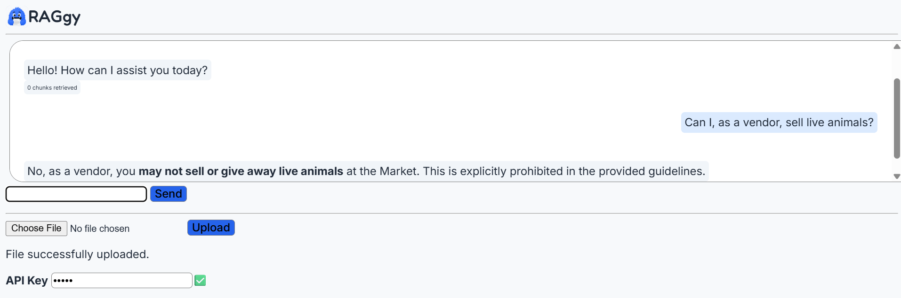

# RAGgy: Backend

Frontend repository: [https://github.com/jpython28/raggy-frontend](https://github.com/jpython28/raggy-frontend)

Site (deployed on Render): [https://raggy-frontend.onrender.com](https://raggy-frontend.onrender.com/)

 

 RAGgy showcases a simple Retrieval-Augmented Generation chatbot, designed for the user to upload text files and query them through a chat. Displays to the user how many chunks of ingested documents were passed to the LLM.

## How it Works
1. Document is uploaded
2. Document is chunked
3. New chunks are checked against vector DB to check for a duplicate document
3. Chunks are embedded
4. Chunks are stored in persistent vector DB
5. Query is sent
6. Query is embedded
7. Top-k nearest chunks are retrieved
8. Nearest chunks are copared to similarity threshold
9. Chunks and query are sent to an LLM
10. Response is returned

## Technology Stack
 * FastAPI for backend
 * ChromaDB for vector DB
 * Mistral API for LLM
 * sentence-transformers (through Chroma) for embedding
 * Deployed on Render

## Key features
 * New chunks are queried on the vector DB, and similarities are compared to a threshold. If the number of matching chunks is over a threshold, the document is refused.
 * LLM system prompt tells it to respond that it doesn't know if insufficient context is provided, therefore greatly reducing hallucination.
 * Context chunks are not included in chat history to decrease token usage.

## Setup

1. Clone the repo
2. `pip install -r requirements.txt`
3. Requires the following environment variables:
    * `OPENAI_API_KEY`: Your API key for the LLM API you choose to use
    * `API_KEY`: The API key that you will use to access the RAGgy API
4. Setup the `config.yaml`:
    * `database`:
        * `path`: Where to save the persistent vector DB
    * `ingestion`:
        * `chunk_size`: Size of chunks
        * `chunk_overlap`: How much chunks should overlap
        * `max_ingestion_characters`: Maximum character length of documents
        * `duplicate_similarity_threshold`: How similar chunks must be to be considered duplicates
        * `max_duplicate_chunks`: How many chunks must be duplicates to refuse a document
    * `llm`:
        * `max_prompt_length`: Maximum prompt length
        * `base_url`: url to your chosen LLM API
        * `model`: Name of model to use from your chosen LLM API
        * `instructions`: System prompt for the LLM
        * `similarity_threshold`: Minimum similarity for a chunk to be included as context
        * `max_chunks`: Maximum number of chunks to include as context
        * `openai_timeout`: Number of seconds before the LLM API call times out

## API Endpoints
 - POST `/query`: Send a query to the model
 - POST `/documents`: Upload a document
 - GET `/health`: Check status of the server

## Limitations
 * Render's free tier only allows for semi-persistent memory. The database is deleted every time the server winds down or is redeployed.
 * Duplicate detection has a fixed threshold, meaning small documents could slip by, or on very large databases false duplicates could be reported.
 * No support for deleting/editing documents.

## Contact Me
You can reach me via email through `jschaller2028@gmail.com`.